# Resumo RI 22/23

## Real world robotics

- **Transducer** - changes energy forms:
  - Robot <-Transducer-> World
  - Measures something and transforms into eletric signals
- Robot -Transucer (Actuators)-> World
- Robot <-Transucer (Sensors)- World
- Robot (robota) means forced labour
- **COBOT** - collaborative robot
  - Safety - around humns
  - Light weight - in order to be portable (suitable for multi tasks)
  - Simplicity - operators do not need background knowledge to work with/teach
    about them
  - Low expenses - cheap acquisition and maintenance
  - Flexibility - dexterous and flexble (7 DOF)

## Actuators

- Actuators + Motors are transducers:
  - Rotative (torque)
  - Linear (force)
- Internal combustion efficiency `<30%`

### Physics

- Mechanical Power (P) = Speed (n) \* Torque (M)
  - Measured in Watts (W)
- Electrical Power (P) = Voltage (V) \* Current (I)
  - Measured in Watts (W)
- Efficiency => Power_out / Power_in (percentage %)
- Torque - "rotation force" => force \* distance

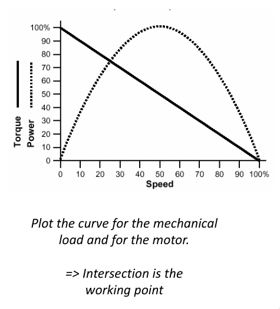

**Point of work of actuator** - interception of actuator curve and load curve

### Servo motor

- External behavior is similar to ideal actuator:
  - linear, fast, safe

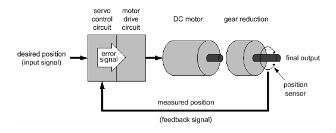

### Gears

Exchange speed for torque.

### Solenoid

- Electro magnet with air core.
- Simplest electric actuator.

## Locomotion

### Wheels

- Differential drive - 2 rodas (wheelchair)
- Ackerman - 4 rodas (carro)
- Tricycle - 3 rodas

### Omniwheels

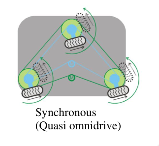

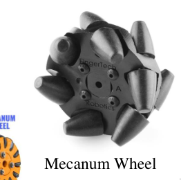

### Kinematics & Dynamics

#### Differential ground robot

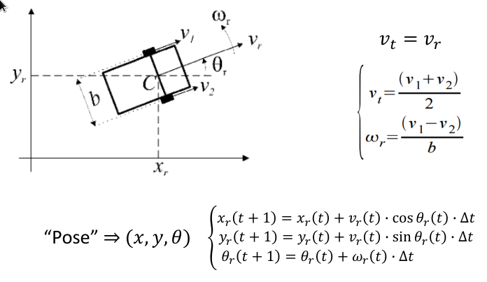

## Manipulators

### Joints

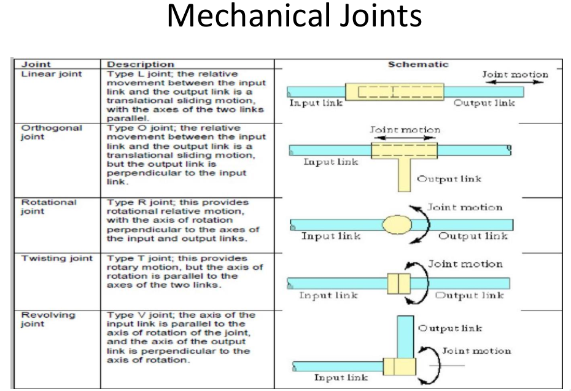

### Effector (End effector)

Actuator at the end of robot to affect the world.

## Sensors

Robot must perceive its physical environment to get information about itself and
its surroundings.

- Transducer
- Map physical attribute to measure
- Produce measurements over time
- Sensor “chain” (perception chain likely hardware + software)
- Transducer + electronics + Analog-to-Digital-Conveter (ADC) + software

### Current sensing methods

- Action oriented perception – Direct link between perception and action
- Expectation-based perception – Sensor interpretation constraining based on
  world knowledge
- Task-driven attention – Direct perception where information is needed or
  likely to be provided (focus-of-attention)
- Perceptual classes – Partition world in manageable categories

### Accuracy

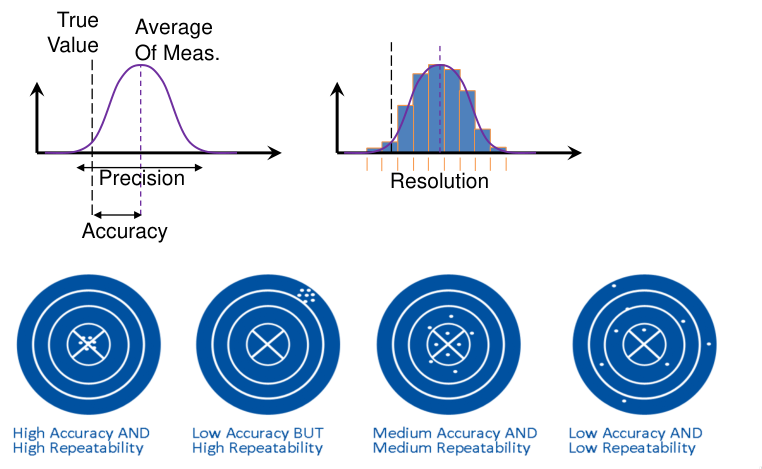

### Errors

- **Systematic errors**:
  - Always push the measured value in the same direction
  - **Can be reduced by sensor calibration**
- **Non-systematic errors**:
  - Have a more random behavior
  - Cannot be predicted or eliminated by calibration
- **Interference note**:
  - Difference from systematic error
  - Can be measured and corrected by sensor fusion like techniques

### Classification of sensors

- **Passive sensors**:
  - Rely on environment to provide the medium for observation
  - Less energy
  - Reduced signal-to-noise ratio
- **Active sensors**:
  - Emits form of energy and measures the impact
  - Restricted environments
- Proprioceptive:
  - Measure system internal values
  - Eg: motor speed, battery status, etc...
- Exteroceptive:
  - Information from the robots external environment
  - Generally considering the robots frame of reference
  - Depend on something external

### Potentiometer

- Variable resistance
- Can be used to detect angular or linear position

### Encoders/odometry

- Physical principle - record the wheel traversed distance
- Wheel traversed distance is used to estimate robot position and orientation

### GPS/DGPS

- Physical principle - triangulation over the distance to several satellites
- Estimates longitude, latitute, and altitude:
  - resolution os 10-15m
- Differential GPS:
  - Extra GPS receivers at known locations
  - Reduces error
  - Resolution of a few centimeters

### Proximity sensors - Bumper

- Physical principle - direct contact closes/opens a circuit
- Used to detect collisions
- Binary value
- Reliable but the collision is eminent

### Proximity sensors - Infrared

- Physical principle - IR emitter/receiver is used to detect distance or as a
  barrier
- Used to estimate distance, presence of objects or color
- Several technologies
- Range from 10cm to 1m
- Narrow field of view
- Cheap

### Proximity sensors - Sonar

- Physical principle - Emit ultra-sonic chirp, time until echo is received is
  used to estimate distance
- Time until echo is proportional to the distance until obstacle

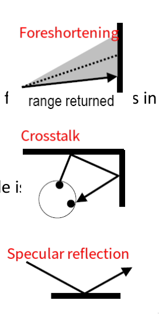

### Proximity sensors - Laser Range Finder

Similar to sonar but uses lasers.

### Depth sensing

- Stereo-vision:
  - Problem: no features (e.g. parede branca)
  - Sol: **active stereo** - adicionar um laser auxiliar
- Structured light:
  - Iluminar surface com um padrao
  - Camera consegue extrair depth info so com 1 imagem

## Robot architectures

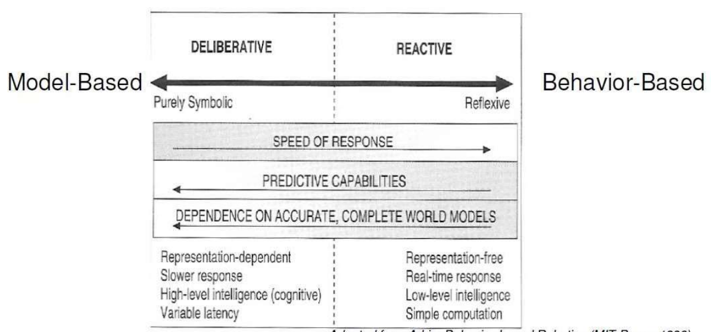

### Hierarchical/Deliberative

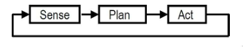

### Reactive

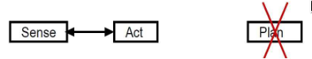

- Cheap/low memory processing
- Lack temporal consistency and stability
- No world model - Difficult to localize robot on world

### Behavior-based

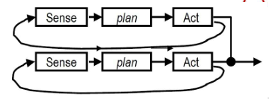

- Combination of simple behaviors
- No centralized world model
- Each behavior may store own representation

### Hybrid

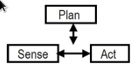

- Combine Reactive and Deliberative approaches
- Mais usado hoje em dia

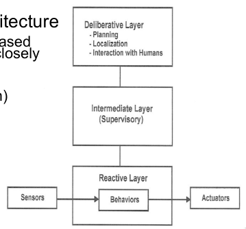

## Localization

- Position estimation
- Pose can't be sensed directly:
  - Usar sensors
  - Geralmente, 1 sensor não chega

### Local vs. Global localization

- Position tracking:
  - Initial pose is known
  - Local uncertainty around robot's true pose
- Global localization:
  - Initial pose is unknown
  - Kidnapped robot:
    - Robot can be teleported to different location

> Local techniques aim at compensating odo- metric errors during robot
> navigation. They require that the initial location of the robot is
> approximately known and they typically cannot recover if they lose track of
> the robot’s position. Global techniques can localize a robot without any prior
> knowledge about its position, i.e., they can han- dle the kidnapped robot
> problem, in which a robot is kidnapped and carried to some unknown location.
> Global localization techniques are more powerful than local ones and can cope
> with situations in which the robot is likely to experience serious positioning
> errors.

Source: "Local and Global Localization for Mobile Robots using Visual
Landmarks", by Stephen Se, David Lowe, Jim Little

### Taxonomy for localization

- Static vs. Dynamic Environments
- Passive vs. Active Approaches
- Single-robot vs. Multi-robot

### Markov localization

- Probabilistic state estimation
- Belief func - the prob distribution of the estimated pos of the robot for
  every possible pos.

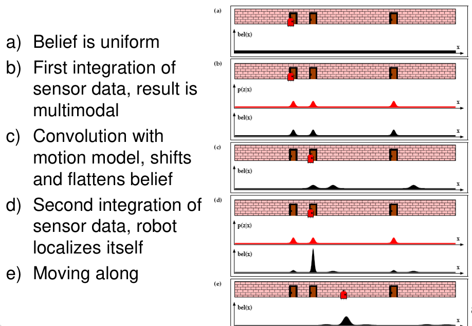

### EKF localization

- Caso especial de Markov
- Features are identifiable

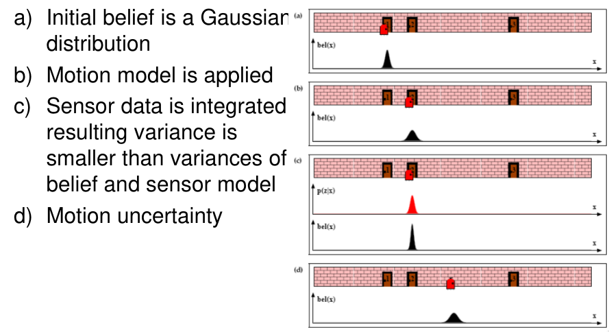

### Multi-hypothesis tracking

- Extension to basic EKF
- Belief is represented by multiple Gaussians

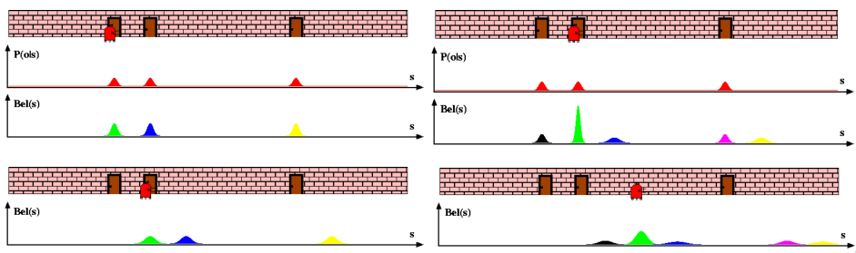

### Grid localization

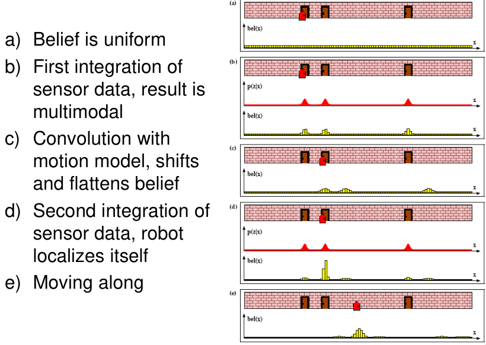

- Same but with histograms

### Monte Carlo Sampling

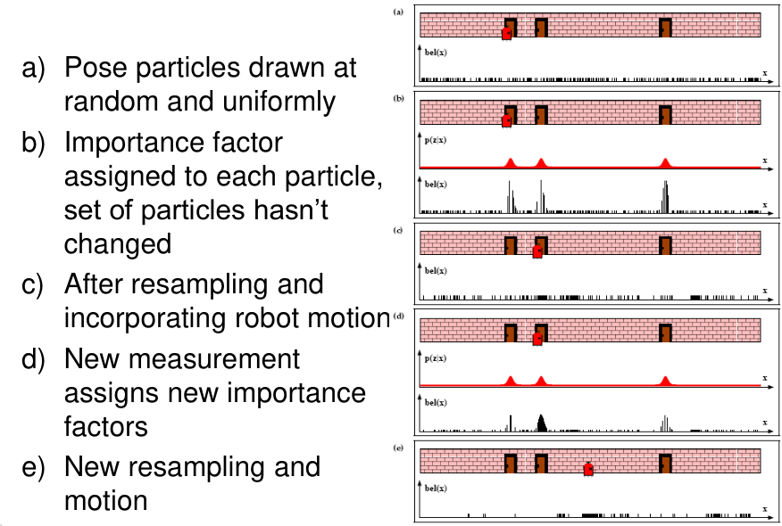

- Começa com barrinhas random
- Dá ressample para concentrar particles onde há mais importantes
- Particles num sítio ficam mais importantes quando o robot vê coisas nesse
  sítio.

## Mapping

- The process of building an internal estimate of the metric map of the
  environment.

### Dempster-Schafer theory

- Belief func em vez de probabilities:
  - Main difference from probabilities is that uncertainties in the reading
    count as belief mass for `dontknow`
- Frame of Discernement - set of propositions:
  - In occupancy grid FOD = {Occupied, Empty}
  - Sensor reading may be considered ambiguous
- Belief function properties
  - Bel = m({Occupied}), m({Empty}), m(dontknow)
  - dontknow = {Occupied,Empty}

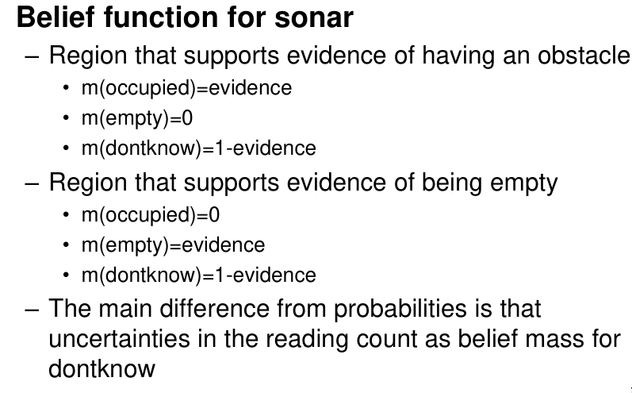

## SLAM

- Cycle through localization and mapping

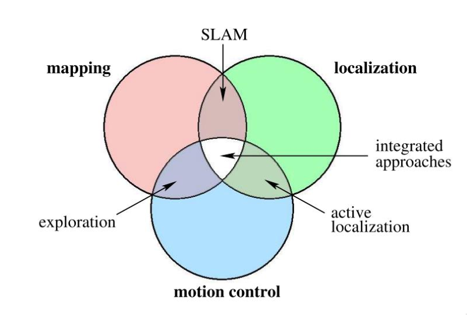

### Uncertainty

- Mapping between observations and the map is unknown
- Picking wrong associations causes divergence

### Position thingy

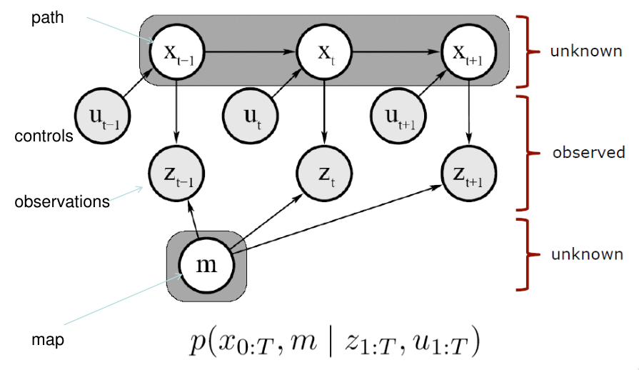

### Motion + observation model

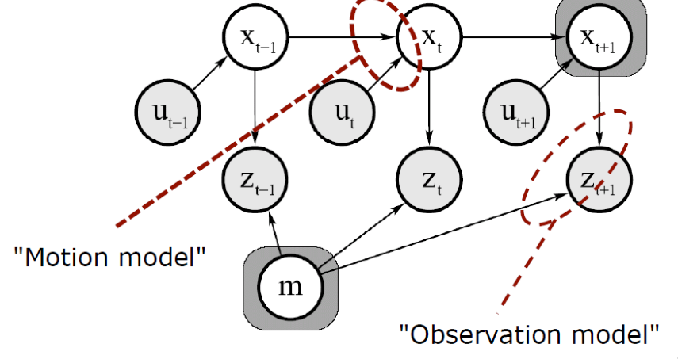

- Motion model - describes the relative motion of the robot
- Observation (or sensor) model - relates measurements with robot's pose

## Navigation

- How do I get where I want to go

### Challenges

- Path planning problem:
  - robot has a map
  - knows own and target positions
- Localization problem:
  - robot has a map
  - knows target position
  - doesn't know own position
- Coverage problem:
  - robot has a map
  - knows own position
  - doesn't know target position
- Mapping problem
  - robot doesn't have a map
  - may know own position
- SLAM:
  - robot doesn't have a map
  - robot doesn't know own position

### Metric Maps and Topological Maps

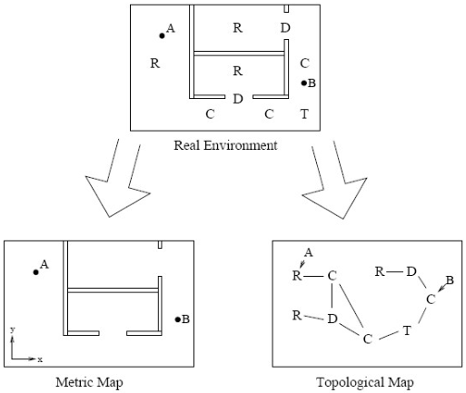

### Visibility graph

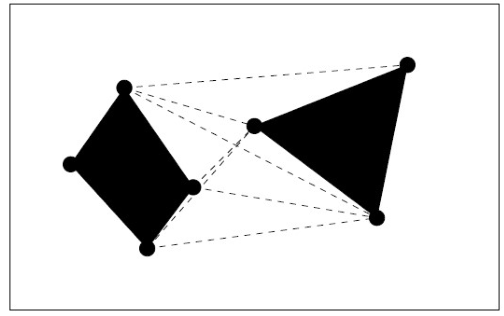

- Nodes are obstacles angles
- Edges connect nodes that are visible from each other

### Voronoi diagram

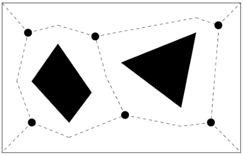

– Voronoi edges are equidistant to the closest obstacles – Nodes are situated at
the points where edges meet

### Exact cell decomposition

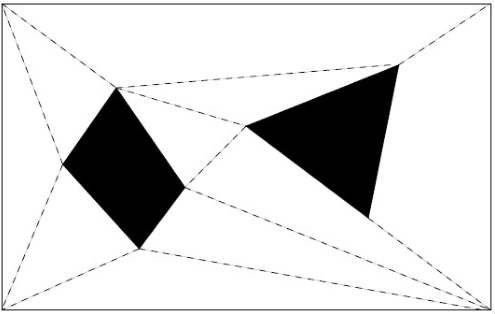

– Partition the free space into convex polygons

### Rectangular cell decomposition

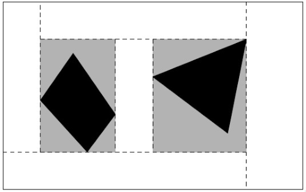

### Regular cell decomposition

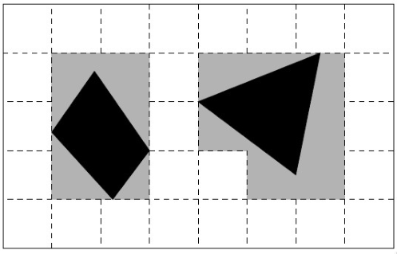

### Quadtree cell decomposition

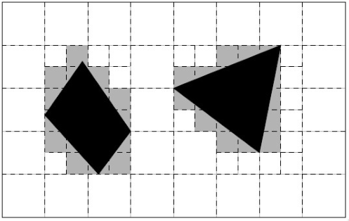

### Potential field local planning

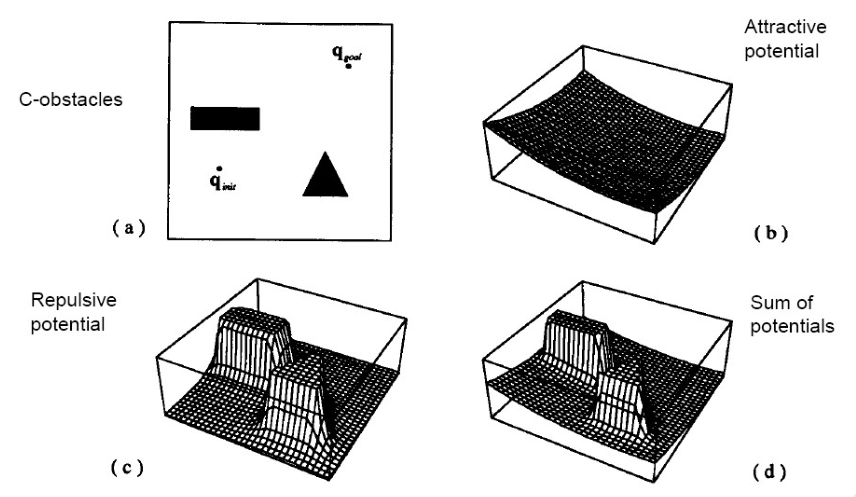

- Gradient descent
- Obstáculos são repulsive
- Target é atrativo
- Soma-se os potenciais
